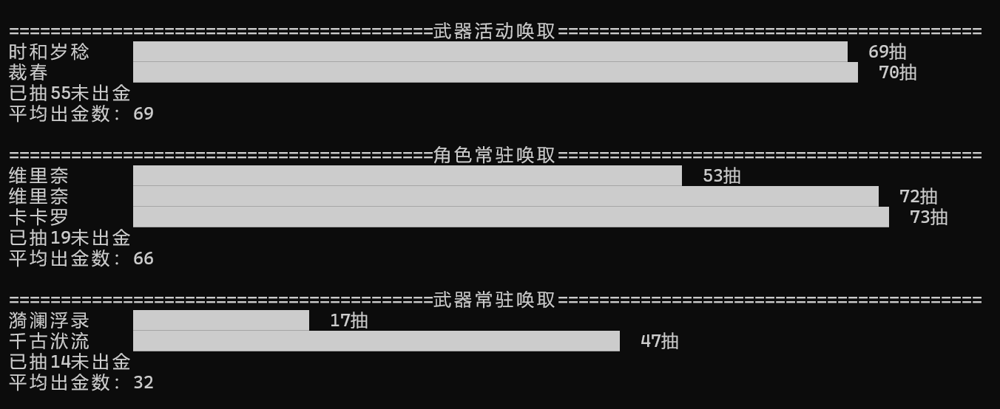

# 鸣潮唤取记录导出工具  
**Wuthering Waves Convene Export**

## 📌 项目简介
本工具用于导出游戏《鸣潮（Wuthering Waves）》中的唤取（抽卡）记录数据，支持多种格式输出，方便玩家进行数据分析、记录保存等操作。

目前只支持国服导出。且只支持导出简体中文，英语的记录，很快会修改。

## ✨ 功能特性
- 📂 自动识别游戏安装目录及日志文件（无需手动查找）
- 📝 支持多种导出格式：
  - Excel（`.xlsx`）
  - CSV
  - UIGF v3.0 / v4.0
- 🔄 支持唤取记录合并
- 💻 Windows 平台支持，使用 C++ 编写，运行高效
- 🧾 控制台操作简洁直观，后续计划编写图形界面（基于 Qt）
- 🌐 当前支持中文，后续将支持多语言界面

## 🚀 快速开始

### ✅ 运行环境
- Windows 10 或更高版本
- 直接运行，无需额外依赖（内置所需库）

### 下载链接
- github realease
- 蓝奏云链接 https://wwuk.lanzouo.com/b004ina3gb 密码:1234

### 📥 使用步骤
1. **打开游戏客户端**
2. **点击游戏内的“历史记录”按钮**
3. **运行本程序**
4. 在控制台中选择：
   - `查找游戏`：程序将尝试自动识别游戏安装目录与日志文件  
   - 若识别失败，可手动选择游戏目录
5. **选择“更新数据”**：程序将自动解析日志并更新唤取记录
6. **更新完成后**，你可以：
   - 选择 **查看当前数据**
     展示效果大致为
     
   - 或选择 **导出唤取记录**，将其保存为 Excel / CSV / UIGF(这里指的是类uigf格式，uigf并不支持鸣潮) 等格式

### 📤 导出文件结构
程序运行后将在 `./export/` 文件夹下生成对应格式的导出文件，目录结构如下：
```
/export/
├── excel/ # Excel格式导出文件 (.xlsx)
├── csv/ # CSV格式文件
├── UIGFv3/ # UIGF v3.0 兼容格式
└── UIGFv4/ # UIGF v4.0 兼容格式
```


## 🧩 技术实现
- **语言**：C++17 + Python（辅助模块）
- **主要依赖库**：
  - [`nlohmann/json`](https://github.com/nlohmann/json)：用于 JSON 数据读写
  - [`picosha2`](https://github.com/okdshin/PicoSHA2)：用于生成记录指纹
  - [`cpp-httplib`](https://github.com/yhirose/cpp-httplib)：用于网络请求
  - （计划）Qt：用于未来图形界面开发

## 📃 许可证
本项目采用 **GNU General Public License v3.0 (GPLv3)**。

这意味着你可以自由地使用、修改和分发本项目，前提是你：
- 保留原始版权声明和许可协议；
- 如将本项目用于开发其他软件，**该软件也必须采用 GPLv3 协议进行开源**。
详见：[LICENSE](./LICENSE)

## 🛣️ 开发计划
- [x] 支持游戏路径与日志的自动识别
- [x] 支持数据更新与去重
- [ ] 构建跨平台图形化界面（基于 Qt）
- [ ] 多语言支持（简体中文、英文、其他）
- [ ] 绘制唤取分析图表（抽卡概率曲线、角色/武器获取分布等）

## 🙌 致谢
- [nlohmann/json](https://github.com/nlohmann/json)
- [picosha2](https://github.com/okdshin/PicoSHA2)
- [cpp-httplib](https://github.com/yhirose/cpp-httplib)

## 📬 联系方式 / 问题反馈
如果你在使用中遇到问题，欢迎通过 GitHub Issues 提出反馈或建议。
